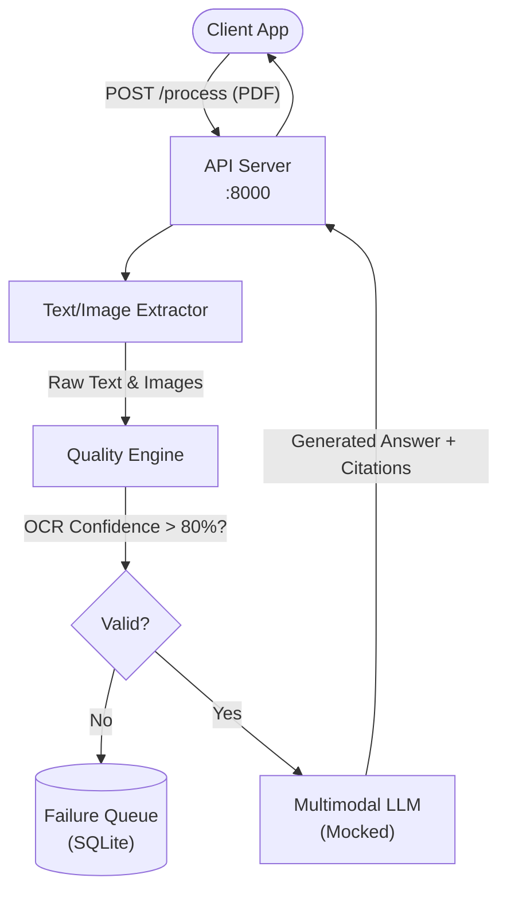

# Architecture — multimodal-document-processor
> Last updated: 2026-08-29 | Maturity: Partial Prototype
> _Processing pipeline with OCR metrics, citations, and failure queues._

## System Diagram

## Component Table
| Component | File | Responsibility | Tech |
|---|---|---|---|
| API Server | `src/main.py` | Receives documents | FastAPI |
| Quality Engine | `src/quality.py` | Calculates OCR confidence | Python |
| Store | `src/db.py` | Failure review queue | SQLite |

## Dependency Honesty Table
| Dependency | Status | Notes |
|---|---|---|
| PDF Parsing | **Real** | Capable of parsing local PDFs and evaluating text density. |
| Multimodal API | **Mocked** | Returns static answers with bounding box citations. |

## Component Breakdown
- **Core Technology**: Python, Tesseract, EasyOCR, Pydantic
- **Design Paradigm**: Emphasizes high availability, fault tolerance, and security.