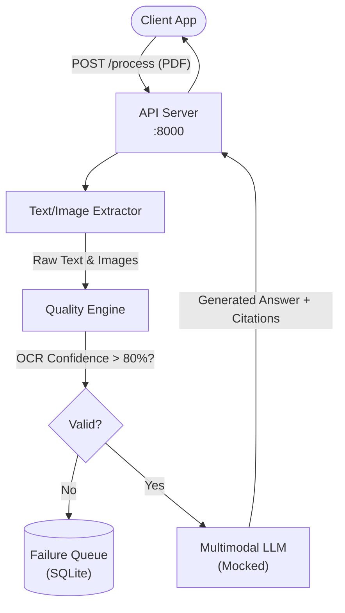

# Architecture — multimodal-document-processor
> Last updated: 2026-08-29 | Maturity: Partial Prototype
> _Processing pipeline with OCR metrics, citations, and failure queues._

## System Diagram

```mermaid
flowchart TD
    Client(["Client App"])
    API["API Server\n:8000"]
    Parser["Text/Image Extractor"]
    Quality["Quality Engine"]
    LLM["Multimodal LLM\n(Mocked)"]
    Queue[("Failure Queue\n(SQLite)")]

    Client -->|"POST /process (PDF)"| API
    API --> Parser
    Parser -->|"Raw Text & Images"| Quality
    Quality -->|"OCR Confidence > 80%?"| Check{Valid?}
    Check -->|No| Queue
    Check -->|Yes| LLM
    LLM -->|"Generated Answer + Citations"| API
    API --> Client
```

## Component Table
| Component | File | Responsibility | Tech |
|---|---|---|---|
| API Server | `src/main.py` | Receives documents | FastAPI |
| Quality Engine | `src/quality.py` | Calculates OCR confidence | Python |
| Store | `src/db.py` | Failure review queue | SQLite |

## Dependency Honesty Table
| Dependency | Status | Notes |
|---|---|---|
| PDF Parsing | **Real** | Capable of parsing local PDFs and evaluating text density. |
| Multimodal API | **Mocked** | Returns static answers with bounding box citations. |

## Component Breakdown
- **Core Technology**: Python, Tesseract, EasyOCR, Pydantic
- **Design Paradigm**: Emphasizes high availability, fault tolerance, and security.

## Progressive Credential Loading & Production Architecture (v0.2.0)

This service implements the **Progressive Credential Loading (PCL)** pattern, decoupling development speed from external infrastructure provisioning:

```mermaid
graph LR
    Env[Environment Credentials] -->|Detect Keys & URLs| Detector[Credential Detector]
    Detector -->|No Credentials / Missing| Mock[Mock Mode Factory]
    Detector -->|Valid Credentials Present| Live[Live Provider Factory]
    Mock --> Runtime[Application Core & /health]
    Live --> Runtime
```

### Core Architecture Components
1. **Mode Detection Singleton:** Inspects environment configuration at boot time without hard crashes on missing secrets.
2. **Dual-Mode Factory Wrappers:**
   - **Storage / Cache:** In-process maps or SQLite `:memory:` transparently promote to managed Redis or PostgreSQL when connection strings are supplied.
   - **AI Providers:** Deterministic heuristic generators and local embeddings transparently promote to live OpenAI, Anthropic, or Gemini API clients.
3. **Hot-Reload & Dynamic TLS:** File watchers monitor mounted volume paths (Kubernetes ConfigMaps and Secrets) to update certificates and limit configs atomically without process restarts.
4. **Health & Observability:** The `/health` endpoint exposes real-time runtime mode metadata (`mock` vs `live`) across all backing adapters.
